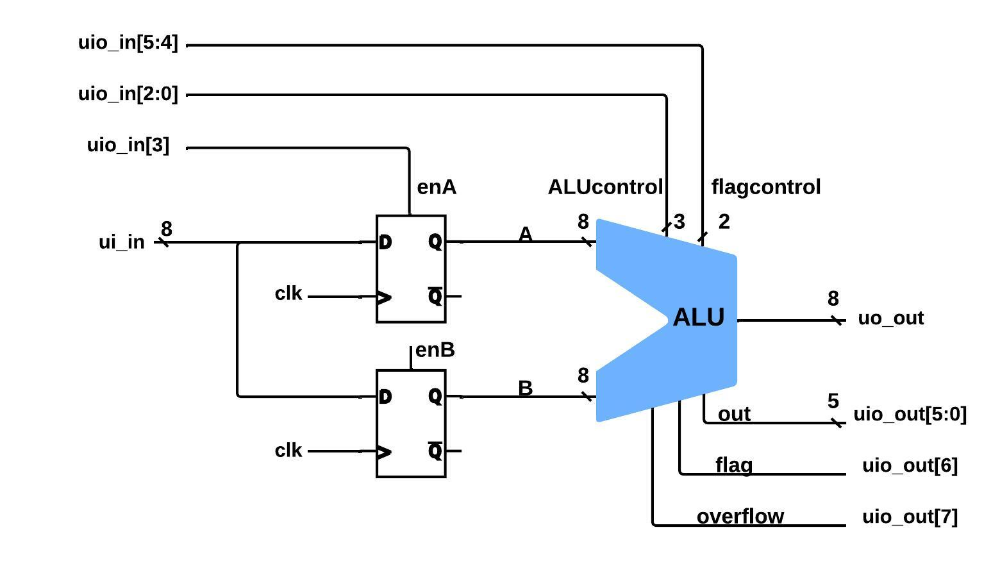

# ALU 8-bits

This ALU supports 8 operations of numbers of 8-bits, controlled by the 3-bit signal ALUcontrol (uio_in[2:0]): 

- Addition (000)
- Subtraction (001)
- Logical shift left (010)
- Logical shift right (011)
- AND (100)
- OR (101)
- XOR (110)
- Multiplication (111)

It also supports 4 operations of 1-bit, controlled by the 2-bit signal flagcontrol (uio_in[5:4]), and the output is the signal flag (uio_out[6]): 

- A > B (00)
- A = B (01)
- A = 0 (10)
- If A is even, the output is 1 (11)

De signal enA (uio_in[3]) controls which number is being stored (A or B).

  

# What is Tiny Tapeout?

TinyTapeout is an educational project that aims to make it easier and cheaper than ever to get your digital designs manufactured on a real chip!

Go to https://tinytapeout.com for instructions!

## How to change the Wokwi project

Edit the [info.yaml](info.yaml) and change the wokwi_id to match your project.

## How to enable the GitHub actions to build the ASIC files

Please see the instructions for:

- [Enabling GitHub Actions](https://tinytapeout.com/faq/#when-i-commit-my-change-the-gds-action-isnt-running)
- [Enabling GitHub Pages](https://tinytapeout.com/faq/#my-github-action-is-failing-on-the-pages-part)

## How does it work?

When you edit the info.yaml to choose a different ID, the [GitHub Action](.github/workflows/gds.yaml) will fetch the digital netlist of your design from Wokwi.

After that, the action uses the open source ASIC tool called [OpenLane](https://www.zerotoasiccourse.com/terminology/openlane/) to build the files needed to fabricate an ASIC.

## Resources

- [FAQ](https://tinytapeout.com/faq/)
- [Digital design lessons](https://tinytapeout.com/digital_design/)
- [Learn how semiconductors work](https://tinytapeout.com/siliwiz/)
- [Join the community](https://discord.gg/rPK2nSjxy8)

## What next?

- Submit your design to the next shuttle [on the website](https://tinytapeout.com/#submit-your-design), the closing date is 8th September.
- Share your GDS on Twitter, tag it [#tinytapeout](https://twitter.com/hashtag/tinytapeout?src=hashtag_click) and [link me](https://twitter.com/matthewvenn)!
